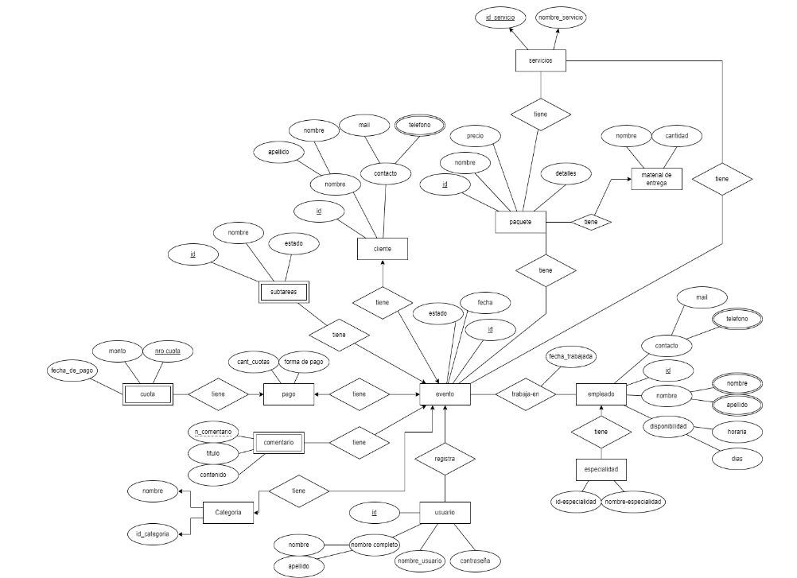
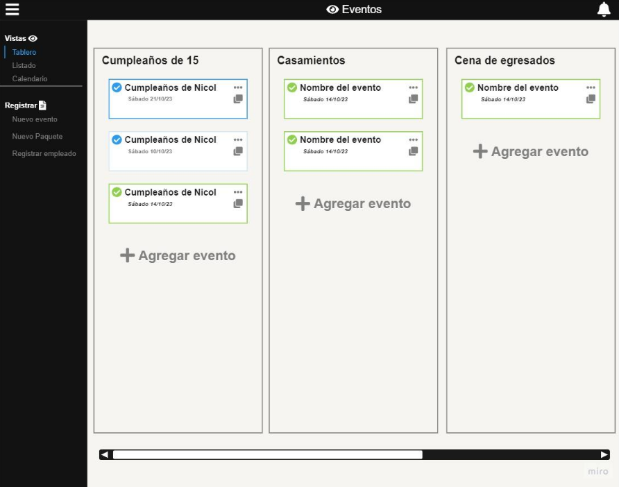
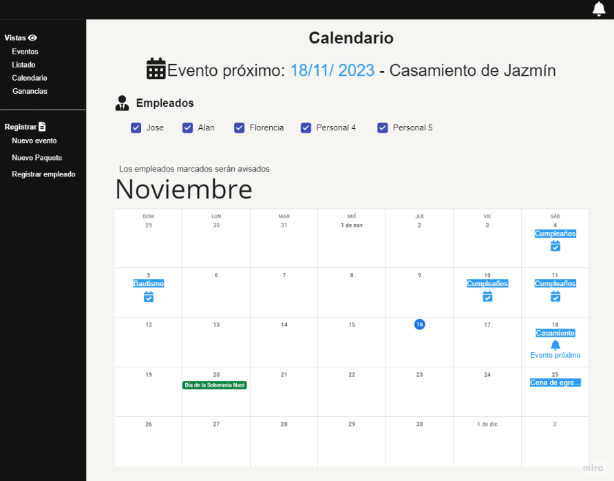
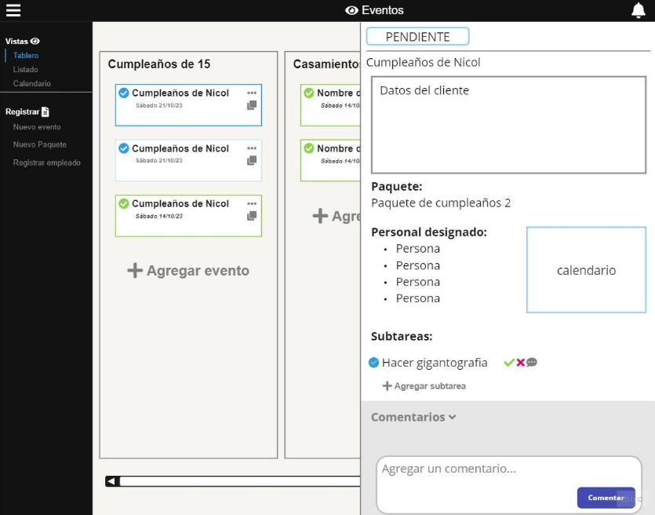
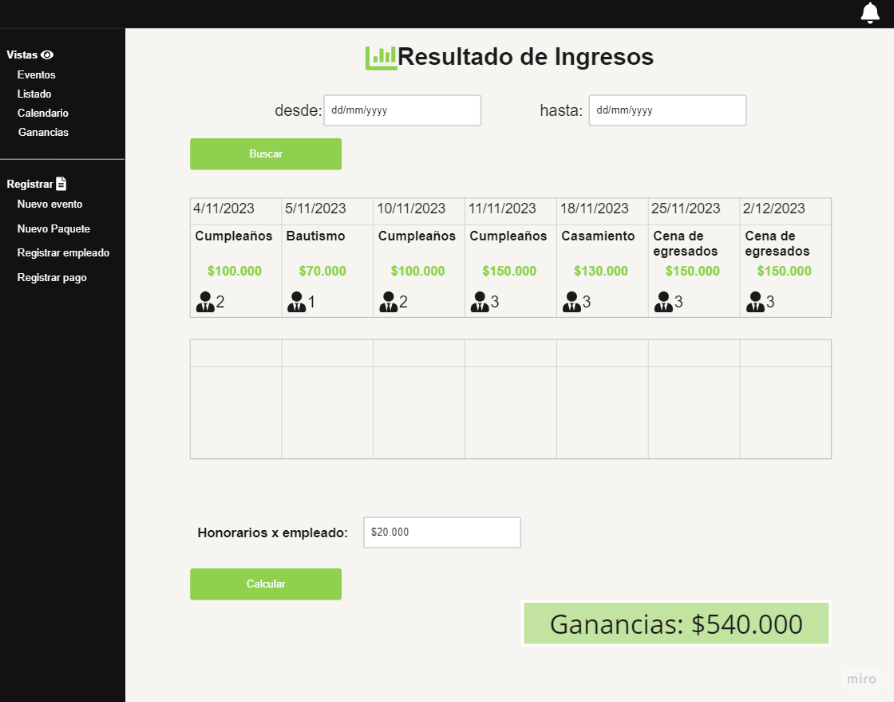

# Signos Producciones Management System

Fullstack web application developed for managing events, employees, services and production workflows for an event production company.

The project centralizes operational information that was previously distributed across notebooks, messaging applications and spreadsheets, improving organization and event tracking.

---

# Overview

The application was developed as a professional practice academic project focused on improving the internal organization of an event production company specialized in photography and video production.

The system supports the complete event workflow, including:

* Pre-production
* Production
* Post-production

The platform allows administrators and staff to manage events, assign employees, organize services, register comments and visualize operational information through a centralized system.

---

# Main Features

* Event management
* Employee assignment
* Service and package registration
* Event comments and modifications
* Calendar visualization
* Upcoming event alerts
* Administrative dashboards
* Payment tracking
* Event detail visualization

---

# Business Context

The application was designed for a real event production business specialized in:

* Photography
* Video production
* 360 booth services
* Photo booths
* Event books
* Video stories
* Gigantography

The main objective was to centralize information and improve operational management.

---

# Tech Stack

## Frontend

* Vue.js
* TypeScript

## Backend

* Spring Boot
* Java

## Database

* PostgreSQL

---

# Architecture

The application follows a layered backend architecture separating:

* Controllers
* Business logic
* Persistence layer

The frontend communicates with the backend through REST APIs.

---

# User Roles

## Administrator

Can manage:

* Events
* Employees
* Services
* Packages
* Reports
* Payment tracking

## Secretary

Can manage:

* Event workflows
* Assignments
* Event organization

---

# Database Design

## Entity Relationship Diagram

---

# Main Use Cases

* Register events
* Assign employees to events
* Register services and packages
* Add comments to events
* Generate occupied dates calendar
* Visualize upcoming events
* Manage production workflow

---

# Screenshots

## Dashboard

## Event Calendar

## Event Details

## Revenue Overview

---

# Documentation

Additional project documentation can be found in the `/docs` folder:

* Use cases
* Feasibility analysis
* Relational database model
* Functional requirements

---

# What I Learned

* Fullstack application development
* REST API integration
* Database modeling
* Business requirement analysis
* Frontend/backend communication
* Team collaboration
* System organization and documentation

---

# Future Improvements

* Authentication and authorization improvements
* Automated testing
* Docker support
* Monitoring and logging
* Improved modularization

---

# Author

Iván Miranda
